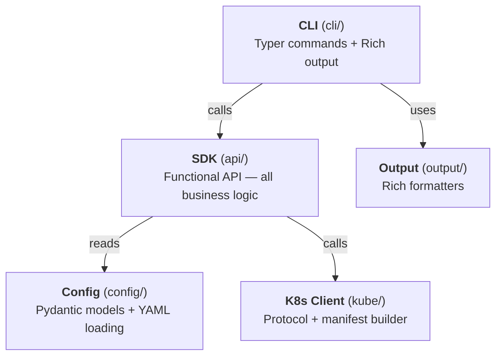
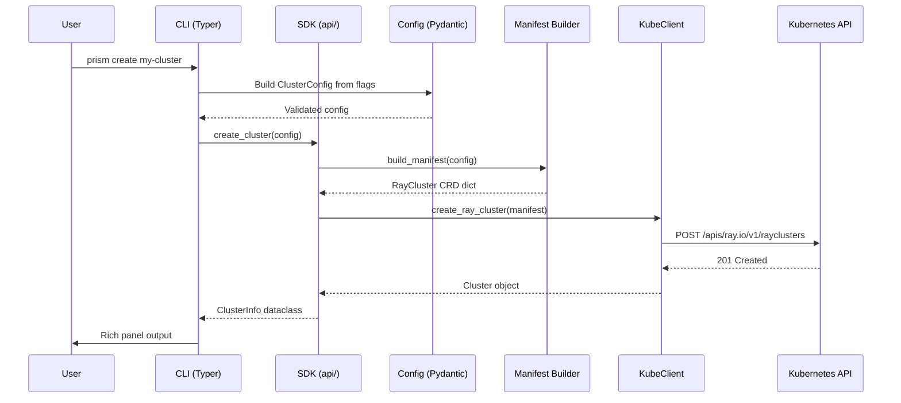
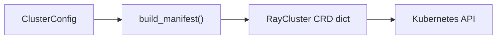
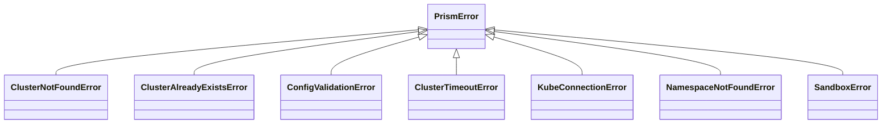

# Architecture

Prism is organized into five modules with a clear dependency direction. This page describes the module structure, design principles, and how the pieces fit together.

## Module overview

**Dependency rule:** `cli/` depends on `api/`. `api/` depends on `config/` and `kube/`. Nothing depends on `cli/`. The `output/` module is used only by `cli/`.

## Modules

### `prism.cli` — CLI layer

The CLI is a **thin Typer shell** over the SDK. It has three responsibilities:

1. Parse command-line arguments
2. Call the corresponding SDK function
3. Format the result for the terminal

No business logic lives here. If a feature can't be tested through the SDK alone, it's in the wrong layer.

### `prism.api` — SDK layer

The core of Prism. All cluster lifecycle operations are implemented as **free functions**:

- `create_cluster()`, `get_cluster()`, `list_clusters()`
- `describe_cluster()`, `scale_cluster()`, `delete_cluster()`
- `wait_until_ready()`

Each function takes explicit parameters and returns immutable dataclasses. The Kubernetes client is injected via the `client` parameter (defaults to `None`, which creates a client from kubeconfig).

### `prism.config` — Configuration layer

[Pydantic models](https://docs.pydantic.dev/) for cluster configuration:

- `ClusterConfig` — top-level config
- `HeadNodeConfig`, `WorkerGroupConfig`, `ServicesConfig` — nested models
- `load_config_from_yaml()` — YAML loading with override support

Validation happens at this boundary. By the time data reaches the SDK, it's guaranteed to be valid.

### `prism.kube` — Kubernetes client layer

The only module that talks to the Kubernetes API. Contains:

- **`KubeClient` protocol** — structural interface (`Protocol`) for K8s operations
- **`DefaultKubeClient`** — implementation using the official `kubernetes` Python client
- **`build_manifest()`** — pure function that converts `ClusterConfig` into a KubeRay `RayCluster` CRD dict

The protocol-based design means any object with the right methods works as a client — no inheritance, no registration.

### `prism.output` — Output formatters

Rich formatters for CLI display:

- `format_cluster_created()` — success panel after creation
- `format_cluster_list()` — table of clusters
- `format_cluster_details()` — multi-table detailed view
- `format_json()` — JSON output for any dataclass

---

## Request flow

This sequence diagram shows what happens when you run `prism create my-cluster`:

---

## Design principles

### Functional-first

Behavior lives in free functions, not classes. Data lives in dataclasses and Pydantic models. There are no inheritance hierarchies, no abstract base classes for business logic.

**Why:** Functions are stateless, composable, and trivial to test. Pass input, get output, assert.

### CLI = SDK

The CLI is a thin wrapper. Every operation available from the command line is available as a Python function with the same semantics.

**Why:** Users who start with the CLI can graduate to the SDK for automation without learning a new API.

### Progressive disclosure

Every command works with zero flags. Defaults produce a working cluster. Power users override via flags or YAML.

**Why:** Low barrier to entry. ML practitioners shouldn't need Kubernetes expertise to get a cluster.

### Explicit dependencies

The `KubeClient` is passed as a parameter, never imported directly by the SDK functions. Default `None` means "create from kubeconfig" — explicit, not magical.

**Why:** Makes the dependency visible at every call site. Makes testing straightforward.

### Pydantic at the boundary

All configuration input is validated by Pydantic models. Return types are plain frozen dataclasses (output doesn't need re-validation).

**Why:** Catches invalid config early with clear error messages. Return types stay simple and fast.

---

## Manifest generation

The `build_manifest()` function is a **pure function** that converts a `ClusterConfig` into a KubeRay `RayCluster` custom resource dict. It has no side effects and no I/O — it's deterministic and easy to snapshot-test.

**CRD mapping:**

| Prism Config | KubeRay CRD Path |
|---|---|
| `config.name` | `metadata.name` |
| `config.namespace` | `metadata.namespace` |
| `head.cpus` | `spec.headGroupSpec...resources.requests.cpu` |
| `head.memory` | `spec.headGroupSpec...resources.requests.memory` |
| `worker_groups[n].replicas` | `spec.workerGroupSpecs[n].replicas` |
| `worker_groups[n].gpus` | `spec.workerGroupSpecs[n]...resources.limits[nvidia.com/gpu]` |
| `worker_groups[n].gpu_type` | `spec.workerGroupSpecs[n]...nodeSelector[cloud.google.com/gke-accelerator]` |

---

## Error handling

All exceptions inherit from `PrismError`:

The CLI catches `PrismError` and renders a Rich panel. SDK users catch specific subtypes for fine-grained handling.

---

## Testing strategy

| Layer | Approach |
|---|---|
| **Config** | Unit tests: valid/invalid inputs, default merging, YAML round-trips |
| **K8s Client** | Mock `kubernetes-client`. Snapshot-test `build_manifest()` output. |
| **SDK** | Inject mock `KubeClient`. Test full lifecycle independently. |
| **CLI** | Typer `CliRunner` snapshot tests for output formatting and flag parsing. |
| **Integration** | End-to-end against a real or kind cluster. Full create/scale/delete lifecycle. |

The `KubeClient` protocol is the key enabler: unit tests inject a `MagicMock`, integration tests use `DefaultKubeClient` against a real cluster.
