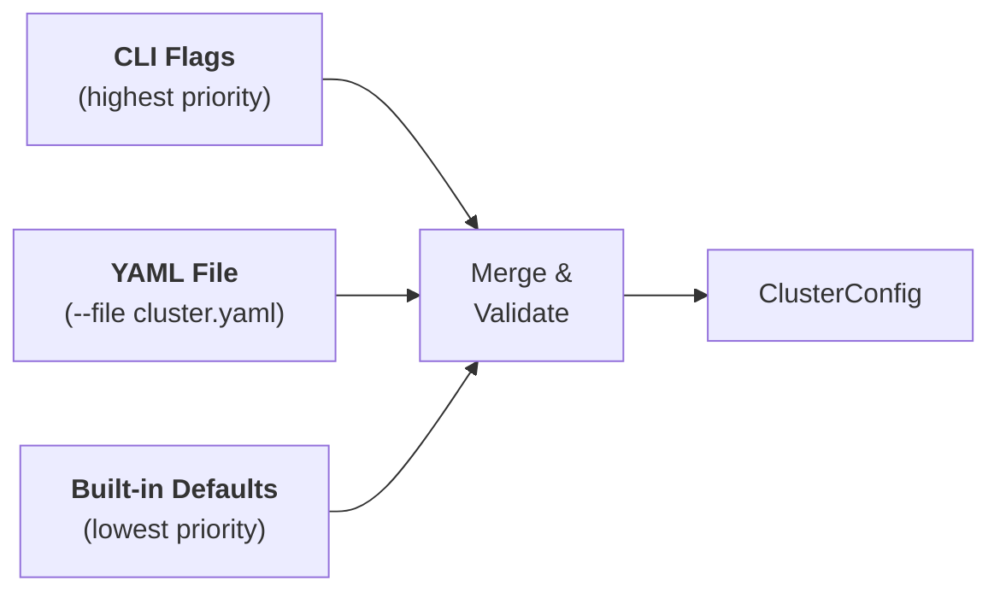

# Configuration

Krayne uses [Pydantic v2](https://docs.pydantic.dev/) models for all cluster configuration. This provides type validation, sensible defaults, and clear error messages for invalid input.

---

## Configuration sources

Configuration is resolved from three sources, in order of precedence (highest wins):



1. **CLI flags** — individual options like `--gpus-per-worker 1`
2. **YAML file** — full cluster spec via `--file cluster.yaml`
3. **Built-in defaults** — sensible values so zero-config works

---

## Minimal configuration

The only required field is `name`. Everything else has a default:

=== "CLI"

    ```bash
    krayne create my-cluster
    ```

=== "Python"

    ```python
    from krayne.config import ClusterConfig
    config = ClusterConfig(name="my-cluster")
    ```

=== "YAML"

    ```yaml
    name: my-cluster
    ```

This creates a cluster with:

- Head: 15 CPUs, 48 Gi memory, no GPUs
- 1 worker group: autoscaling from 0 to 1 worker (0 initial)
- Autoscaling enabled by default
- Jupyter notebook + SSH enabled

---

## Autoscaling

Krayne enables [Ray v2 in-tree autoscaling](https://docs.ray.io/en/latest/cluster/kubernetes/user-guides/configuring-autoscaling.html) by default. The Ray autoscaler sidecar runs on the head pod and dynamically scales worker groups between configurable min/max bounds.

### Default behavior

By default, worker groups start with `min_replicas=0`, `replicas=0`, `max_replicas=1`. The autoscaler will scale workers up when Ray tasks or actors demand resources, and scale them back down after an idle timeout.

### CLI flags

```bash
# Create with custom autoscaling bounds
krayne create my-cluster --min-workers 0 --max-workers 10 --workers 2

# Disable autoscaling (pin replicas)
krayne create my-cluster --no-autoscaling --workers 4
```

### YAML configuration

```yaml title="cluster-autoscaling.yaml"
name: my-experiment
autoscaler:
  enabled: true
  idle_timeout_seconds: 120
  upscaling_mode: Aggressive   # Default, Aggressive, or Conservative
worker_groups:
  - name: gpu-workers
    replicas: 2
    min_replicas: 0
    max_replicas: 10
    gpus: 1
    gpu_type: a100
```

### Python SDK

```python
from krayne.config import ClusterConfig, WorkerGroupConfig, AutoscalerConfig

config = ClusterConfig(
    name="auto-cluster",
    autoscaler=AutoscalerConfig(idle_timeout_seconds=120),
    worker_groups=[
        WorkerGroupConfig(replicas=2, min_replicas=0, max_replicas=10),
    ],
)
```

### Disabling autoscaling

Set `autoscaler.enabled = false` to pin `minReplicas == maxReplicas == replicas` in the manifest (no autoscaler sidecar):

```yaml
autoscaler:
  enabled: false
worker_groups:
  - replicas: 4
    min_replicas: 4
    max_replicas: 4
```

---

## YAML configuration

For complex setups, define your cluster in a YAML file:

```yaml title="cluster.yaml"
name: my-experiment
namespace: ml-team
head:
  cpus: 8
  memory: 32Gi
worker_groups:
  - name: cpu-workers
    replicas: 4
    cpus: 15
    memory: 48Gi
  - name: gpu-workers
    replicas: 2
    gpus: 1
    gpu_type: a100
    image: rayproject/ray:2.41.0-gpu
services:
  notebook: true
  code_server: true
```

```bash
krayne create my-experiment --file cluster.yaml
```

### Overriding YAML values with CLI flags

CLI flags take precedence over YAML values:

```bash
# YAML sets workers=1, but this creates 4
krayne create my-experiment --file cluster.yaml --workers 4
```

### Loading YAML from Python

```python
from krayne.config import load_config_from_yaml

# Basic load
config = load_config_from_yaml("cluster.yaml")

# With overrides (supports dot-notation for nested fields)
config = load_config_from_yaml(
    "cluster.yaml",
    overrides={"namespace": "staging", "head.cpus": 32},
)
```

---

## Default values rationale

| Default | Value | Why |
|---|---|---|
| Head CPUs | `15` | Enough for GCS + dashboard + scheduling |
| Head Memory | `48Gi` | Comfortable for object store and metadata |
| Head GPUs | `0` | Head should not run GPU workloads |
| Worker Replicas | `0` | Autoscaler manages worker count |
| Worker Min Replicas | `0` | Scale to zero when idle |
| Worker Max Replicas | `1` | Conservative default; increase for production |
| Worker CPUs | `15` | Matches typical cloud node size |
| Worker Memory | `48Gi` | Comfortable for most training workloads |
| Worker GPUs | `0` | CPU-only by default; opt in via flag |
| GPU Type | `t4` | Most available, cost-effective default |
| Autoscaling | enabled | Ray v2 autoscaler manages worker lifecycle |
| Idle Timeout | `60s` | Scale down unused workers after 60 seconds |
| Notebook | enabled | Most users want immediate notebook access |
| Code Server | disabled | Opt-in; not all users need it |

---

## Config validation

`ClusterConfig` uses Pydantic's `extra = "forbid"` mode — unknown fields in YAML or keyword arguments raise a `ConfigValidationError`:

```python
from krayne.config import ClusterConfig

# This raises ConfigValidationError — "unknown_field" is not a valid field
config = ClusterConfig(name="test", unknown_field="value")
```

```title="Terminal output"
╭──── Error ─────────────────────────────────╮
│ Configuration validation error:            │
│ Extra inputs are not permitted             │
╰────────────────────────────────────────────╯
```

See [Configuration Models Reference](../reference/configuration.md) for full field definitions and types.

---

## What's next

- [Error Handling](error-handling.md) — how to debug and handle errors
- [Configuration Models Reference](../reference/configuration.md) — complete Pydantic model field tables
