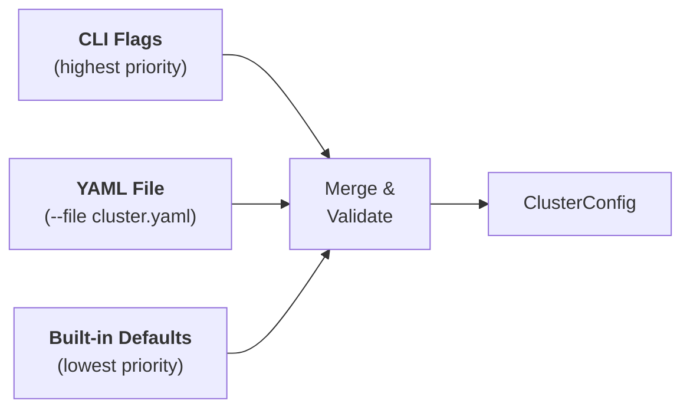

# Configuration

Prism uses [Pydantic v2](https://docs.pydantic.dev/) models for all cluster configuration. This provides type validation, sensible defaults, and clear error messages for invalid input.

---

## Configuration sources

Configuration is resolved from three sources, in order of precedence (highest wins):



1. **CLI flags** — individual options like `--gpus-per-worker 1`
2. **YAML file** — full cluster spec via `--file cluster.yaml`
3. **Built-in defaults** — sensible values so zero-config works

---

## Minimal configuration

The only required field is `name`. Everything else has a default:

=== "CLI"

    ```bash
    prism create my-cluster
    ```

=== "Python"

    ```python
    from prism.config import ClusterConfig
    config = ClusterConfig(name="my-cluster")
    ```

=== "YAML"

    ```yaml
    name: my-cluster
    ```

This creates a cluster with:

- Head: 15 CPUs, 48 Gi memory, no GPUs
- 1 worker: 15 CPUs, 48 Gi memory, no GPUs
- Jupyter notebook + SSH enabled

---

## YAML configuration

For complex setups, define your cluster in a YAML file:

```yaml title="cluster.yaml"
name: my-experiment
namespace: ml-team
head:
  cpus: 8
  memory: 32Gi
worker_groups:
  - name: cpu-workers
    replicas: 4
    cpus: 15
    memory: 48Gi
  - name: gpu-workers
    replicas: 2
    gpus: 1
    gpu_type: a100
    image: rayproject/ray:2.41.0-gpu
services:
  notebook: true
  vscode_server: true
  tutorials: true
```

```bash
prism create my-experiment --file cluster.yaml --wait
```

### Overriding YAML values with CLI flags

CLI flags take precedence over YAML values:

```bash
# YAML sets workers=1, but this creates 4
prism create my-experiment --file cluster.yaml --workers 4
```

### Loading YAML from Python

```python
from prism.config import load_config_from_yaml

# Basic load
config = load_config_from_yaml("cluster.yaml")

# With overrides (supports dot-notation for nested fields)
config = load_config_from_yaml(
    "cluster.yaml",
    overrides={"namespace": "staging", "head.cpus": 32},
)
```

---

## Default values rationale

| Default | Value | Why |
|---|---|---|
| Head CPUs | `15` | Enough for GCS + dashboard + scheduling |
| Head Memory | `48Gi` | Comfortable for object store and metadata |
| Head GPUs | `0` | Head should not run GPU workloads |
| Worker Replicas | `1` | Minimal viable cluster; scale up explicitly |
| Worker CPUs | `15` | Matches typical cloud node size |
| Worker Memory | `48Gi` | Comfortable for most training workloads |
| Worker GPUs | `0` | CPU-only by default; opt in via flag |
| GPU Type | `t4` | Most available, cost-effective default |
| Notebook | enabled | Most users want immediate notebook access |
| VS Code | disabled | Opt-in; not all users need it |

---

## Config validation

`ClusterConfig` uses Pydantic's `extra = "forbid"` mode — unknown fields in YAML or keyword arguments raise a `ConfigValidationError`:

```python
from prism.config import ClusterConfig

# This raises ConfigValidationError — "unknown_field" is not a valid field
config = ClusterConfig(name="test", unknown_field="value")
```

```title="Terminal output"
╭──── Error ─────────────────────────────────╮
│ Configuration validation error:            │
│ Extra inputs are not permitted             │
╰────────────────────────────────────────────╯
```

See [Configuration Models Reference](../reference/configuration.md) for full field definitions and types.

---

## What's next

- [Error Handling](error-handling.md) — how to debug and handle errors
- [Configuration Models Reference](../reference/configuration.md) — complete Pydantic model field tables
