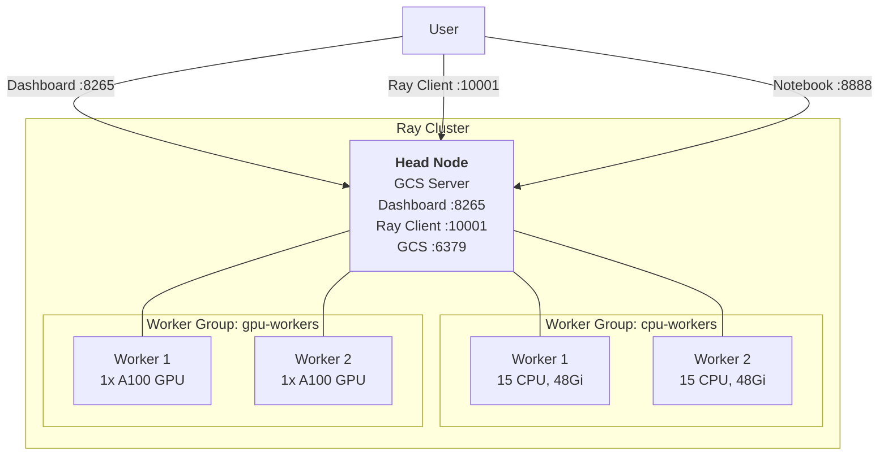
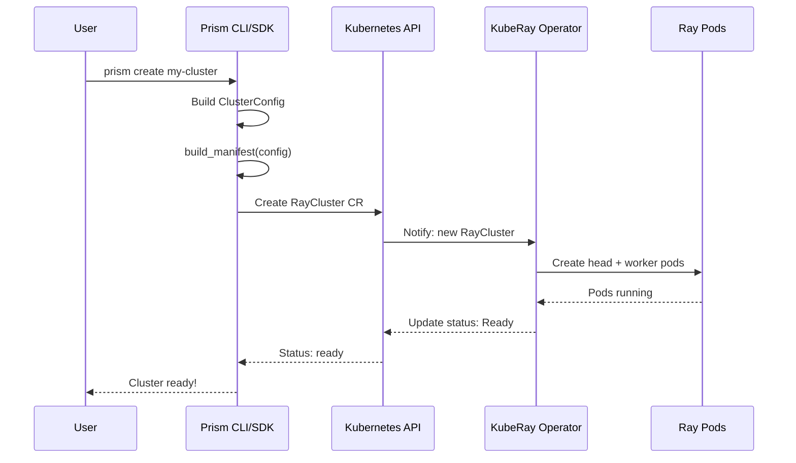
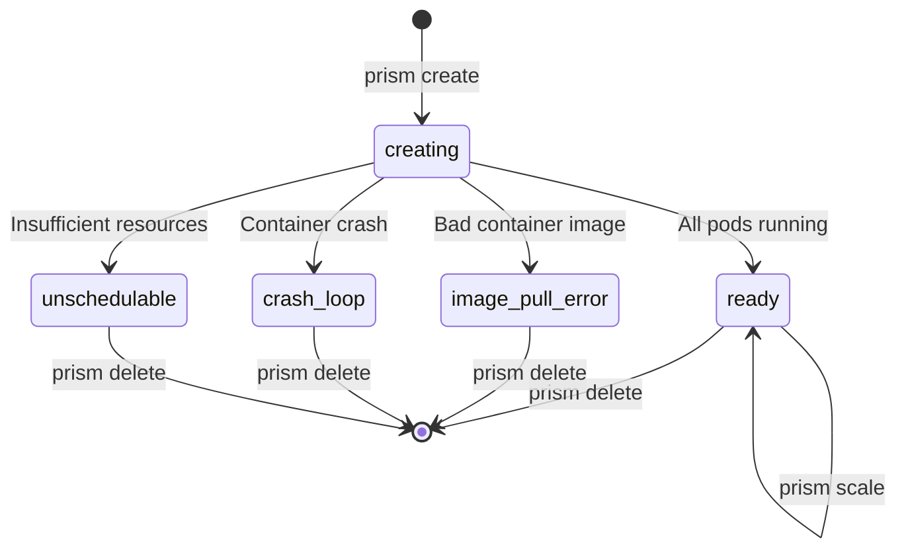
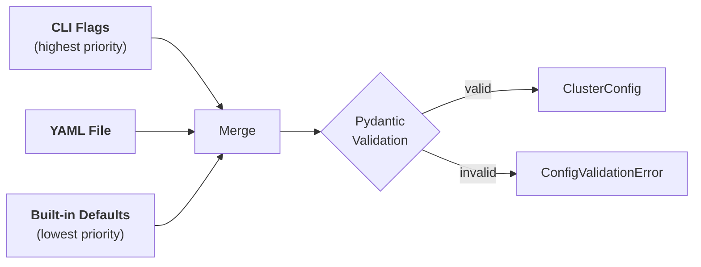

# Core Concepts

This page explains the key concepts behind Prism and Ray on Kubernetes.

---

## Ray cluster anatomy

A Ray cluster consists of a **head node** and one or more **worker groups**. Prism manages these as Kubernetes pods via the KubeRay operator.



| Component | Role |
|---|---|
| **Head node** | Runs the Global Control Service (GCS), Ray dashboard, and scheduling. Does not typically run user workloads. |
| **Worker group** | A set of identically configured worker pods. A cluster can have multiple worker groups (e.g., CPU workers and GPU workers). |
| **Services** | Jupyter notebook, VS Code server, and SSH are optionally exposed on the head node. |

---

## KubeRay and the RayCluster CRD

[KubeRay](https://ray-project.github.io/kuberay/) is a Kubernetes operator that manages Ray clusters via a Custom Resource Definition (CRD): `ray.io/v1/RayCluster`.

Prism generates the `RayCluster` manifest from your configuration and submits it to the Kubernetes API. The KubeRay operator then reconciles the desired state — creating pods, services, and networking.



You never need to write the `RayCluster` YAML yourself — Prism handles manifest generation, submission, and status polling.

---

## Cluster lifecycle

A cluster moves through several states from creation to deletion:



| Status | Meaning |
|---|---|
| `creating` | Cluster submitted, pods being scheduled |
| `ready` | All pods running, cluster operational |
| `containers-creating` | Pod scheduled, pulling images |
| `image-pull-error` | Container image not found or inaccessible |
| `crash-loop` | Container repeatedly crashing (`CrashLoopBackOff`) |
| `unschedulable` | Kubernetes cannot schedule pods (insufficient CPU, memory, or GPUs) |
| `pods-pending` | Pods waiting to be scheduled |
| `running` | Pods running but cluster not fully ready |

Use `prism describe <name>` to check the current status at any time.

---

## Namespaces

Prism scopes all operations to a Kubernetes **namespace**. The default namespace is `default`, but you can specify any namespace:

```bash
# CLI
prism create my-cluster -n ml-team
prism get -n ml-team

# Python SDK
from prism.api import create_cluster
from prism.config import ClusterConfig

config = ClusterConfig(name="my-cluster", namespace="ml-team")
create_cluster(config)
```

Clusters in different namespaces are independent — they can share names without conflict.

---

## Configuration model

Prism uses a layered configuration system with three sources, resolved in order of precedence:



The only required field is `name`. Everything else has sensible defaults:

```bash
# This is a complete, valid command
prism create my-cluster
```

See [Configuration](configuration.md) for the full config model and defaults.

---

## Services

Prism exposes several services on the head node, each mapped to a container port:

| Service | Default | Port | Description |
|---|---|---|---|
| **Jupyter Notebook** | Enabled | 8888 | Web-based notebook environment on the head node |
| **SSH** | Enabled | 22 | SSH access to the head node |
| **VS Code Server** | Disabled | 8080 | Browser-based VS Code via a [code-server](https://github.com/coder/code-server) sidecar container |

When enabled, service URLs appear in `ClusterInfo` (e.g. `notebook_url`, `vscode_url`, `ssh_url`) and in the CLI output.

VS Code Server runs as a **sidecar container** (`codercom/code-server`) alongside the Ray head container. The image can be overridden via the `PRISM_VSCODE_VERSION` environment variable.

Services are configured via the `services` section of `ClusterConfig` or the YAML file:

```yaml
services:
  notebook: true
  vscode_server: true
  ssh: true
```

To access services from your local machine, use `prism tun-start` / `prism tun-close`:

```bash
prism tun-start my-cluster   # start tunnels (idempotent)
prism tun-close my-cluster   # stop tunnels (idempotent)
```

---

## CLI and SDK parity

Every operation available from the CLI is available as a Python function with the same semantics:

| CLI Command | SDK Function | Description |
|---|---|---|
| `prism create` | `create_cluster()` | Create a new cluster |
| `prism get` | `list_clusters()` | List all clusters |
| `prism describe` | `describe_cluster()` | Get detailed cluster info |
| `prism scale` | `scale_cluster()` | Scale a worker group |
| `prism delete` | `delete_cluster()` | Delete a cluster |
| — | `get_cluster()` | Get info for a single cluster |
| — | `wait_until_ready()` | Poll until cluster is ready |

The SDK is designed for automation — use it in scripts, notebooks, and CI/CD pipelines.

---

## What's next

- [Local Sandbox](sandbox.md) — set up a local development environment
- [Creating Clusters](creating-clusters.md) — create CPU, GPU, and multi-worker clusters
- [Configuration](configuration.md) — full config model, defaults, and YAML schema
