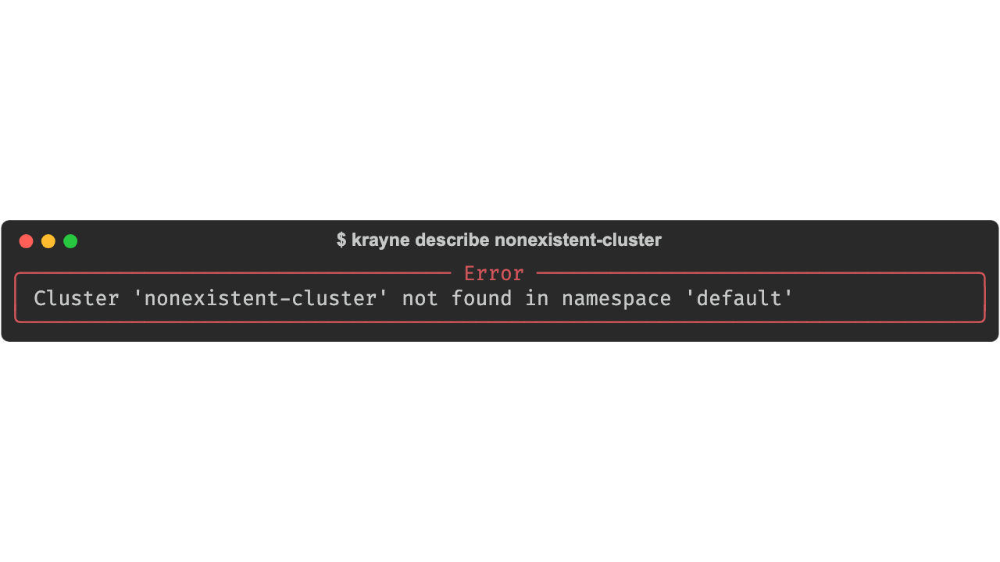
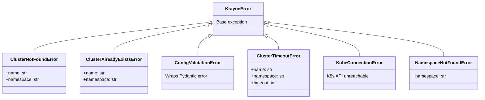
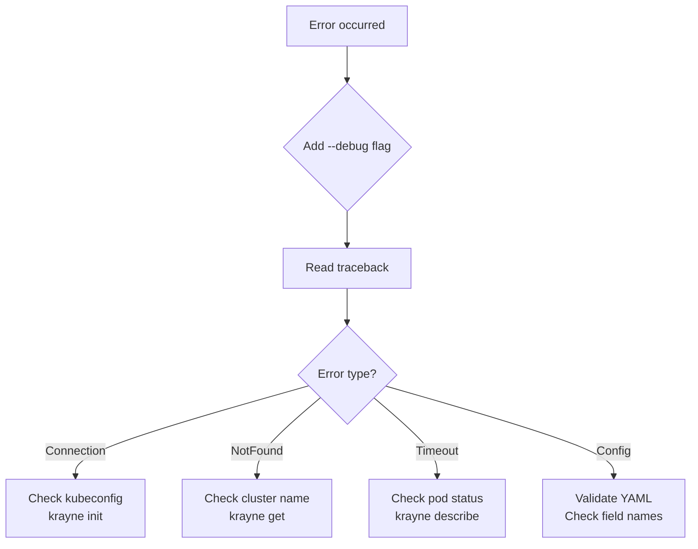

# Error Handling

Krayne provides clear, actionable error messages in both the CLI and SDK. All errors inherit from a single base class, making them easy to catch and handle.

---

## How errors appear in the CLI

By default, errors are displayed as Rich panels with a clean message:



### Debug mode

Use `--debug` to see the full Python traceback:

```bash
$ krayne describe nonexistent-cluster --debug
Traceback (most recent call last):
  File ".../krayne/cli/app.py", line 42, in describe
    details = describe_cluster(name, namespace, client=client)
  File ".../krayne/api/clusters.py", line 89, in describe_cluster
    obj = client.get_ray_cluster(name, namespace)
  ...
krayne.errors.ClusterNotFoundError: Cluster 'nonexistent-cluster'
not found in namespace 'default'
```

---

## Error hierarchy

All Krayne exceptions inherit from `KrayneError`:



---

## Handling errors in Python

### Catch all Krayne errors

```python
from krayne.api import create_cluster
from krayne.errors import KrayneError

try:
    info = create_cluster(config)
except KrayneError as e:
    print(f"Krayne error: {e}")
```

### Catch specific errors

```python
from krayne.api import get_cluster, create_cluster
from krayne.errors import (
    ClusterNotFoundError,
    ClusterAlreadyExistsError,
    ClusterTimeoutError,
    NamespaceNotFoundError,
)

# Handle missing cluster
try:
    info = get_cluster("my-cluster")
except ClusterNotFoundError as e:
    print(f"Cluster '{e.name}' not found in '{e.namespace}'")

# Handle duplicate name
try:
    info = create_cluster(config)
except ClusterAlreadyExistsError as e:
    print(f"Cluster '{e.name}' already exists in '{e.namespace}'")

# Handle timeout
try:
    info = create_cluster(config, wait=True, timeout=60)
except ClusterTimeoutError as e:
    print(f"Cluster '{e.name}' not ready after {e.timeout}s")
```

---

## Common errors and solutions

| Error | Cause | Solution |
|---|---|---|
| `ClusterNotFoundError` | Cluster name doesn't exist in the namespace | Check spelling, verify namespace with `-n` |
| `ClusterAlreadyExistsError` | A cluster with that name already exists | Choose a different name or delete the existing cluster |
| `ConfigValidationError` | Invalid YAML or config values | Check YAML syntax, field names, and value types |
| `ClusterTimeoutError` | Cluster didn't reach `ready` in time | Increase `--timeout`, check pod status with `krayne describe` |
| `KubeConnectionError` | Can't reach Kubernetes API | Check kubeconfig, verify cluster is running, run `krayne init` |
| `NamespaceNotFoundError` | Specified namespace doesn't exist | Create the namespace first with `kubectl create namespace <name>` |

---

## Troubleshooting workflow



1. **Add `--debug`** to get the full traceback
2. **Identify the error type** from the exception class name
3. **Follow the solution** from the table above
4. If the issue persists, check the KubeRay operator logs:
   ```bash
   kubectl logs -l app.kubernetes.io/name=kuberay-operator
   ```

---

## What's next

- [Error Types Reference](../reference/errors.md) — complete exception definitions and attributes
- [CLI Reference](../reference/cli.md) — `--debug` flag documentation
