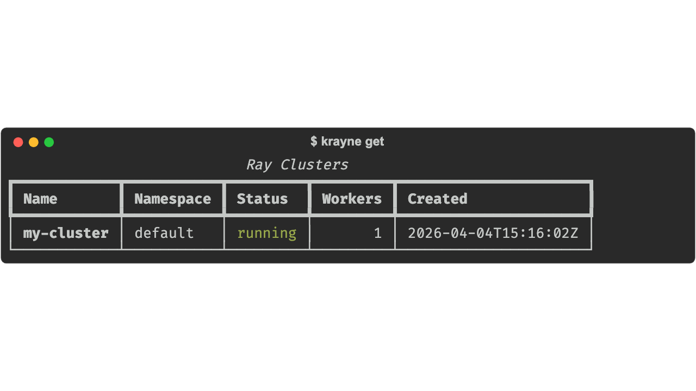
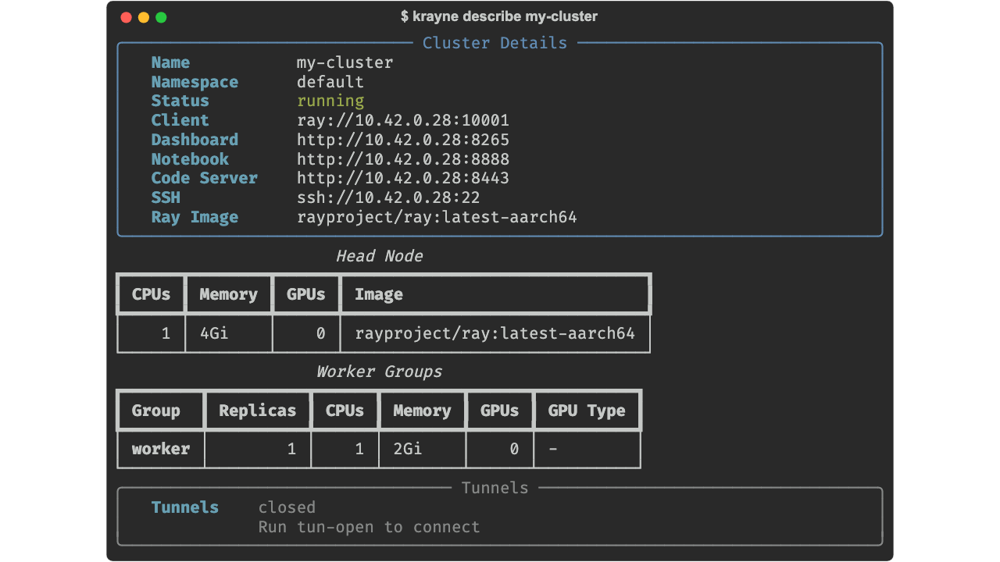
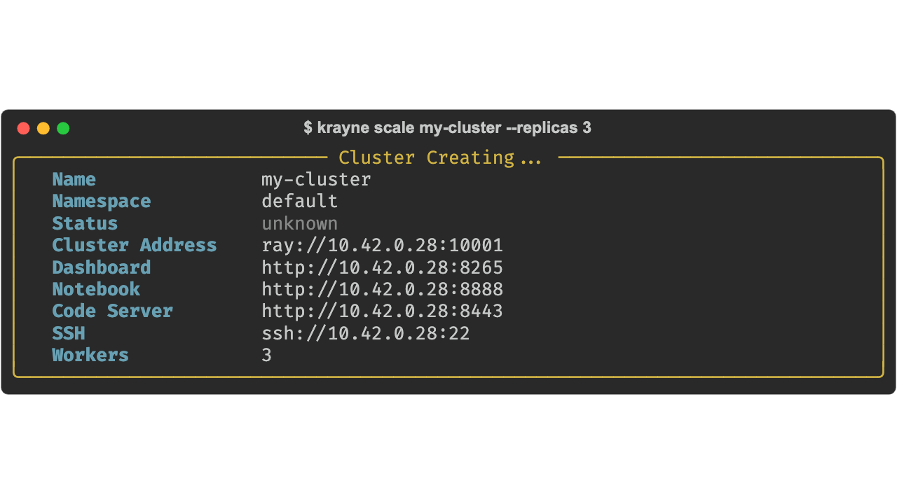
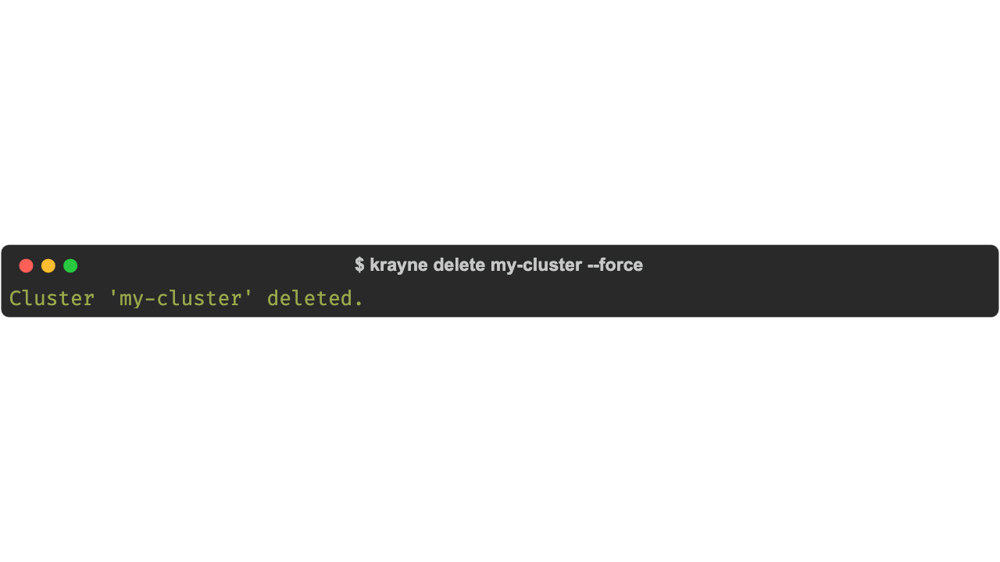

# Managing Clusters

Once a cluster is created, Krayne provides commands to list, inspect, scale, and delete clusters.

---

## Listing clusters

List all Ray clusters in a namespace:

=== "CLI"

    ```bash
    $ krayne get
    ```

    

    List clusters in a specific namespace:

    ```bash
    krayne get -n ml-team
    ```

=== "Python SDK"

    ```python
    from krayne.api import list_clusters

    clusters = list_clusters(namespace="default")
    for cluster in clusters:
        print(f"{cluster.name} — {cluster.status} ({cluster.num_workers} workers)")
    ```

---

## Describing a cluster

Get detailed information about a specific cluster, including resource breakdowns:

=== "CLI"

    ```bash
    $ krayne describe my-cluster
    ```

    

=== "Python SDK"

    ```python
    from krayne.api import describe_cluster

    details = describe_cluster("my-cluster")
    print(f"Head: {details.head.cpus} CPUs, {details.head.memory}")
    for wg in details.worker_groups:
        print(f"  {wg.name}: {wg.replicas}x ({wg.cpus} CPUs, {wg.gpus} GPUs)")
    ```

---

## Scaling workers

Scale a worker group up or down:

=== "CLI"

    ```bash
    # Scale default worker group to 4 replicas
    krayne scale my-cluster --replicas 4
    ```

    

    Scale a named worker group:

    ```bash
    krayne scale my-cluster --worker-group gpu-workers --replicas 8 -n ml-team
    ```

=== "Python SDK"

    ```python
    from krayne.api import scale_cluster

    info = scale_cluster("my-cluster", "default", "worker", replicas=4)
    print(f"Workers: {info.num_workers}")
    ```

!!! note
    Scaling sets `replicas`, `minReplicas`, and `maxReplicas` to the same value, disabling autoscaling for the group.

---

## Deleting a cluster

=== "CLI"

    ```bash
    $ krayne delete my-cluster
    ```

    

    Skip the confirmation prompt with `--force`:

    ```bash
    krayne delete my-cluster --force
    ```

=== "Python SDK"

    ```python
    from krayne.api import delete_cluster

    delete_cluster("my-cluster", namespace="default")
    ```

!!! warning
    Deletion is permanent. All pods, services, and data associated with the cluster are removed.

---

## JSON output

All CLI commands support `--output json` for scripting and piping:

```bash
# List as JSON
krayne get --output json

# Parse with jq
krayne get --output json | jq '.[].name'

# Describe as JSON
krayne describe my-cluster -o json
```

```json title="Example JSON output"
{
  "name": "my-cluster",
  "namespace": "default",
  "status": "ready",
  "dashboard_url": "http://10.0.0.1:8265",
  "client_url": "ray://10.0.0.1:10001",
  "num_workers": 1,
  "created_at": "2026-04-01T10:30:00Z"
}
```

---

## Waiting for a cluster

If you created a cluster without `--wait`, you can wait for it later using the SDK:

```python
from krayne.api import wait_until_ready

info = wait_until_ready("my-cluster", timeout=300)
print(f"Cluster ready: {info.status}")
```

This polls every 2 seconds until the cluster reaches the `ready` state or the timeout expires.

---

## What's next

- [Configuration](configuration.md) — config sources, precedence, and defaults
- [Error Handling](error-handling.md) — debugging and common error solutions
- [CLI Reference](../reference/cli.md) — full command documentation
