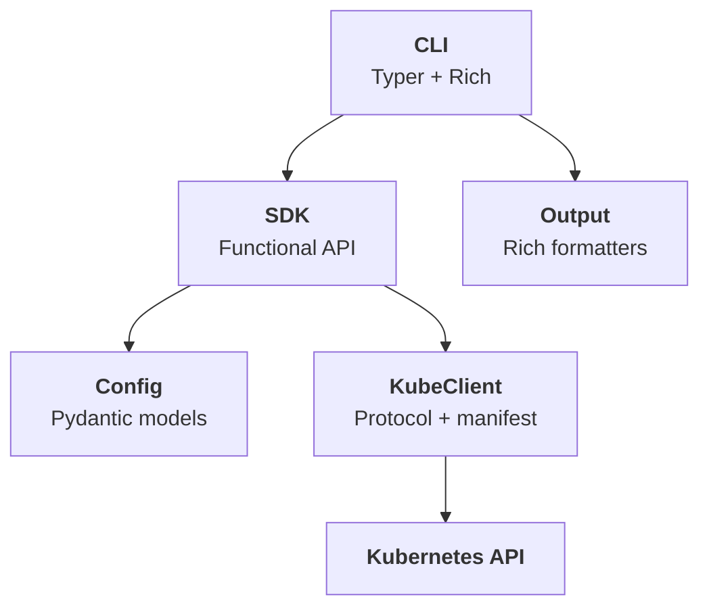

# Overview

Prism is an open-source Python package that provides both a **CLI** and a **Python SDK** for creating, managing, and scaling [Ray](https://www.ray.io/) clusters on Kubernetes. It wraps the [KubeRay](https://ray-project.github.io/kuberay/) operator behind a clean, opinionated interface.

---

## The problem

Running Ray on Kubernetes typically requires:

- Writing verbose YAML manifests for the `RayCluster` custom resource
- Understanding Kubernetes CRDs, pod specs, resource requests, and node selectors
- Stitching together `kubectl` commands for lifecycle management
- Manually configuring services like dashboards, notebooks, and SSH

This is a significant barrier for ML practitioners who just want distributed compute.

## How Prism solves it

Prism abstracts the Kubernetes complexity behind two interfaces that share the same semantics:

=== "CLI"

    ```bash
    prism create my-cluster --gpus-per-worker 1 --workers 4 --wait
    ```

=== "Python SDK"

    ```python
    from prism.api import create_cluster
    from prism.config import ClusterConfig, WorkerGroupConfig

    config = ClusterConfig(
        name="my-cluster",
        worker_groups=[WorkerGroupConfig(replicas=4, gpus=1)],
    )
    info = create_cluster(config, wait=True)
    ```

Both produce the same result: a fully configured Ray cluster with dashboard, notebook, and SSH access.

---

## Architecture at a glance



| Module | Responsibility |
|---|---|
| **CLI** (`prism.cli`) | Parse arguments, call SDK, format output |
| **SDK** (`prism.api`) | All business logic as free functions |
| **Config** (`prism.config`) | Pydantic models + YAML loading |
| **KubeClient** (`prism.kube`) | Kubernetes API calls + manifest building |
| **Output** (`prism.output`) | Rich tables and panels for terminal display |

The CLI is a thin wrapper — every operation available from the command line is available as a Python function with the same semantics.

---

## Key features

| Feature | Description |
|---|---|
| **Zero-config defaults** | `prism create my-cluster` just works — sensible CPU, memory, and service defaults |
| **GPU support** | One flag to add GPUs: `--gpus-per-worker 1 --worker-gpu-type a100` |
| **YAML configuration** | Full cluster spec in a YAML file for version control and reproducibility |
| **Local sandbox** | `prism sandbox setup` spins up a local k3s cluster with KubeRay for development |
| **JSON output** | Every command supports `--output json` for scripting and pipelines |
| **Functional SDK** | Stateless free functions — no classes to instantiate, no state to manage |
| **Testable by design** | `KubeClient` Protocol enables mock injection without patching imports |

---

## What's next

- [Quickstart](quickstart.md) — install Prism and create your first cluster
- [Core Concepts](core-concepts.md) — understand Ray clusters, KubeRay, and the lifecycle
- [CLI Reference](../reference/cli.md) — full command documentation
- [Python SDK Reference](../reference/sdk.md) — function signatures and return types
