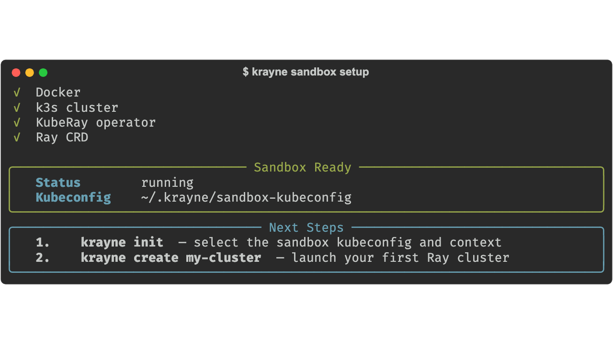
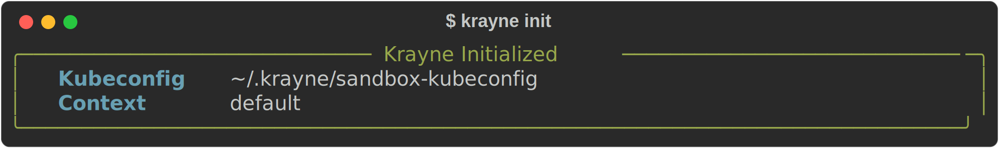

# Quickstart

Get from zero to a running Ray cluster in under 5 minutes.

---

## Prerequisites

- **Python 3.10+**
- **One of:**
    - A Kubernetes cluster with the [KubeRay operator](https://ray-project.github.io/kuberay/) installed
    - Docker (for the local sandbox — no existing cluster needed)

## 1. Install Krayne

```bash
pip install krayne
```

Verify the installation:

```bash
$ krayne --version
krayne 0.1.0
```

## 2. Connect to a cluster

Choose one of two paths:

=== "Local Sandbox (no cluster needed)"

    Spin up a local k3s cluster with KubeRay pre-installed:

    ```bash
    krayne sandbox setup
    ```

    

    The sandbox requires Docker with at least 2 CPUs and 4 GB RAM.

    Then run `krayne init` to select the sandbox kubeconfig:

    ```bash
    krayne init
    ```

    Select **"Sandbox kubeconfig"** when prompted. Krayne auto-selects the `default` context:

    

=== "Existing Kubernetes Cluster"

    Point Krayne at your kubeconfig:

    ```bash
    krayne init
    ```

    This interactively selects your kubeconfig file and Kubernetes context, then saves the settings to `~/.krayne/config.yaml`.

    !!! tip "Non-interactive mode"
        ```bash
        krayne init --kubeconfig ~/.kube/config --context my-context
        ```

## 3. Create your first cluster

You have three paths — pick whichever suits you.

=== "CLI"

    ```bash
    krayne create my-first-cluster
    ```

    

=== "TUI"

    Launch the interactive UI and press `c` to open the create form:

    ```bash
    krayne tui
    ```

    The form is pre-filled with sensible defaults — `Ctrl+S` to submit.

=== "Python SDK"

    ```python
    from krayne.api import create_cluster
    from krayne.config import ClusterConfig, WorkerGroupConfig

    config = ClusterConfig(
        name="my-first-cluster",
        worker_groups=[WorkerGroupConfig(replicas=1, max_replicas=1)],
    )
    create_cluster(config, wait=True)
    ```

The default cluster has:

- **Head node**: 1 CPU, 4 Gi memory (control-plane only — no Ray tasks scheduled here)
- **Workers**: a single ``worker`` group, autoscaling between 0 and 1 replica (1 CPU, 2 Gi memory each)
- **Services**: Jupyter notebook, code-server, and SSH enabled

## 4. Check your cluster

List all clusters:

```bash
$ krayne get
```


Get detailed information:

```bash
$ krayne describe my-first-cluster
```


## 5. Run a Ray job against your cluster

To submit work from your laptop, you need port-forward tunnels so `ray.init` can reach the head node. The `open_tunnel` context manager handles setup and cleanup for you:

```python
import ray
from krayne.api import open_tunnel

with open_tunnel("my-first-cluster") as session:
    ray.init(session.client_url)   # ray://localhost:...

    @ray.remote
    def hello(i: int) -> str:
        return f"Hello from worker {i}"

    print(ray.get([hello.remote(i) for i in range(4)]))
    ray.shutdown()
# tunnels closed when the block exits
```

!!! tip "CLI alternative"
    You can also open tunnels from the shell with `krayne tun-open my-first-cluster` (close with `krayne tun-close my-first-cluster`). The TUI exposes the same on the `t` shortcut.

## 6. Clean up

```bash
krayne delete my-first-cluster --force
```

If you used the sandbox, you can tear it down:

```bash
krayne sandbox teardown
```

---

## What's next

- [Core Concepts](core-concepts.md) — understand Ray clusters, head/worker nodes, and the lifecycle
- [Creating Clusters](creating-clusters.md) — GPU clusters, YAML configs, and the Python SDK
- [Managing Clusters](managing-clusters.md) — scaling, describing, and deleting clusters
- [Configuration](configuration.md) — config sources, defaults, and YAML schema
