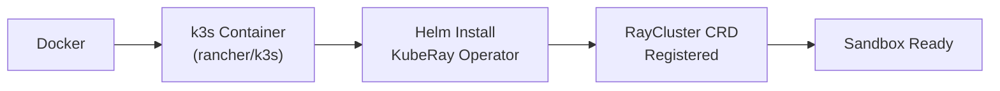

# Local Sandbox

Krayne includes a built-in **sandbox** — a local [k3s](https://k3s.io/) Kubernetes cluster running in Docker with the KubeRay operator pre-installed. This lets you develop and test without an external Kubernetes cluster.

---

## Prerequisites

- **Docker** installed and running
- At least **2 CPUs** and **6 GB RAM** allocated to Docker

!!! tip "Check Docker resources"
    On Docker Desktop, go to **Settings → Resources** to verify CPU and memory allocation.

---

## Setting up the sandbox

```bash
krayne sandbox setup
```

This runs through 7 automated steps:

```title="Terminal output"
          Sandbox Setup
  Component             Status
  Docker                ✓ ready
  K3S Container         ✓ ready
  K3S Node              ✓ ready
  Kubeconfig            ✓ ready
  KubeRay Helm Chart    ✓ ready
  RayCluster CRD        ✓ ready
  Operator Ready        ✓ ready
╭─ Sandbox Ready ─────────────────────────────────╮
│  Status        running                          │
│  Kubeconfig    ~/.krayne/sandbox-kubeconfig       │
╰─────────────────────────────────────────────────╯
╭─ Next Steps ────────────────────────────────────╮
│  1.  krayne init — select the sandbox            │
│      kubeconfig and context                     │
│  2.  krayne create my-cluster — launch your      │
│      first Ray cluster                          │
╰─────────────────────────────────────────────────╯
```

What happens behind the scenes:



1. Validates Docker is available with sufficient resources
2. Creates a k3s container (`krayne-sandbox`)
3. Waits for the k3s node to be ready
4. Extracts kubeconfig to `~/.krayne/sandbox-kubeconfig`
5. Installs the KubeRay Helm chart
6. Waits for the `RayCluster` CRD to be registered
7. Waits for the KubeRay operator deployment to be ready

After setup completes, run `krayne init` to select the sandbox kubeconfig and context:

```bash
krayne init
```

Select "Sandbox kubeconfig" when prompted. This saves the kubeconfig path and context to `~/.krayne/config.yaml`, so all subsequent commands use the sandbox cluster.

---

## Checking sandbox status

```bash
krayne sandbox status
```


---

## Using the sandbox

Once the sandbox is running, all Krayne commands work as normal:

```bash
# Create a cluster in the sandbox
krayne create my-cluster --wait

# List clusters
krayne get

# Describe a cluster
krayne describe my-cluster

# Clean up
krayne delete my-cluster --force
```

### Accessing services locally

Cluster URLs always show the real pod/service IPs. To access services from your local machine, use `krayne tun-open` to create localhost port-forwards:

```bash
krayne tun-open my-cluster   # start tunnels
krayne tun-close my-cluster   # stop tunnels
```

This forwards all enabled services (dashboard, client, notebook, SSH, Code Server) to deterministic localhost ports via `kubectl port-forward`. Both commands are idempotent.

---

## Tearing down the sandbox

```bash
krayne sandbox teardown
```

This removes the Docker container, deletes the sandbox kubeconfig file, and clears Krayne settings if they point to the sandbox.

!!! warning
    Teardown is permanent. All clusters and data in the sandbox are lost.

---

## What's next

- [Creating Clusters](creating-clusters.md) — create your first cluster
- [Quickstart](quickstart.md) — end-to-end walkthrough
