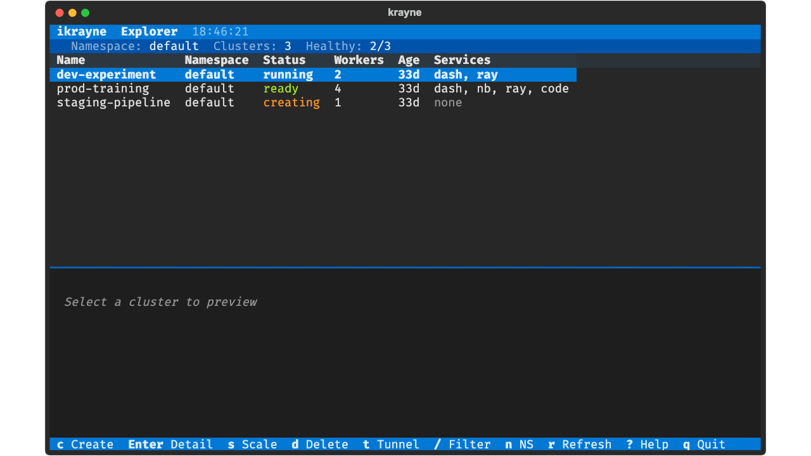

# Krayne

**CLI and SDK for creating, managing, and scaling Ray clusters on Kubernetes.**

Krayne wraps the [KubeRay](https://ray-project.github.io/kuberay/) operator behind a clean, opinionated interface so ML practitioners can get distributed compute without touching Kubernetes manifests.

---

## Get started in seconds

```bash
pip install krayne
krayne create my-cluster --gpus-per-worker 1 --workers 2
```

That's it. One command gives you a fully configured Ray cluster with dashboard, notebook, and SSH access.

---

## Interactive TUI

A fast and intuitive terminal UI is also available:

```bash
krayne tui
```



Navigate clusters, create with prefilled forms, scale, delete, and toggle tunnels — all with keyboard shortcuts.

---

## Why Krayne?

| Pain point | How Krayne helps |
|---|---|
| Verbose KubeRay YAML manifests | `krayne create my-cluster` — zero config needed |
| Kubernetes expertise required | Sensible defaults handle resources, services, and networking |
| No automation path | Python SDK exposes the same operations as functions |
| Scattered tooling | One CLI for create, scale, describe, delete, and tunnels |

---

## CLI and Python SDK

=== "CLI"

    ```bash
    krayne create my-experiment --gpus-per-worker 1 --workers 2
    krayne describe my-experiment
    krayne scale my-experiment --replicas 4
    krayne delete my-experiment --force
    ```

=== "Python SDK"

    ```python
    from krayne.api import create_cluster, scale_cluster, delete_cluster
    from krayne.config import ClusterConfig, WorkerGroupConfig

    config = ClusterConfig(
        name="my-experiment",
        worker_groups=[WorkerGroupConfig(replicas=2, gpus=1, gpu_type="a100")],
    )

    info = create_cluster(config, wait=True)
    print(f"Dashboard: {info.dashboard_url}")

    scale_cluster("my-experiment", "default", "worker", replicas=4)
    delete_cluster("my-experiment", "default")
    ```

---

## Key features

- **Zero-config defaults** — every command works with no flags
- **CLI and SDK** — anything from the terminal works from code too
- **Interactive TUI** — k9s-style keyboard-driven cluster management
- **GPU support** — one flag to add GPUs with type selection
- **Local sandbox** — `krayne sandbox setup` for development without a real cluster
- **Pydantic config** — validated configuration with YAML override support
- **Rich output** — beautiful terminal tables, with `--output json` for scripting

---

<div class="grid cards" markdown>

-   :material-rocket-launch:{ .lg .middle } **Quickstart**

    ---

    Install Krayne and create your first cluster in under 5 minutes.

    [:octicons-arrow-right-24: Get started](guide/quickstart.md)

-   :material-book-open-variant:{ .lg .middle } **Core Concepts**

    ---

    Understand Ray clusters, KubeRay, and the cluster lifecycle.

    [:octicons-arrow-right-24: Learn more](guide/core-concepts.md)

-   :material-console:{ .lg .middle } **CLI Reference**

    ---

    Full reference for every `krayne` command, flag, and option.

    [:octicons-arrow-right-24: CLI docs](reference/cli.md)

-   :material-language-python:{ .lg .middle } **Python SDK**

    ---

    Use Krayne programmatically in scripts, notebooks, and pipelines.

    [:octicons-arrow-right-24: SDK docs](reference/sdk.md)

</div>
