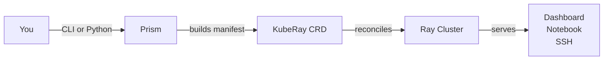

# Prism

**CLI and SDK for creating, managing, and scaling Ray clusters on Kubernetes.**

Prism wraps the [KubeRay](https://ray-project.github.io/kuberay/) operator behind a clean, opinionated interface so ML practitioners can get distributed compute without touching Kubernetes manifests.

> *A prism takes a single beam of light and organizes it into something structured and useful. Prism does the same for Ray clusters.*

---

## Why Prism?

Managing Ray clusters on Kubernetes typically means writing verbose YAML manifests, understanding CRDs, and stitching together kubectl commands. Prism eliminates that friction:

- **One command to a working cluster** — `prism create my-cluster` gives you a Ray cluster with notebooks and SSH ready to go.
- **SDK for automation** — the same operations are available as Python functions for pipelines, scripts, and notebooks.
- **No Kubernetes knowledge required** — sensible defaults handle resource allocation, service configuration, and manifest generation.
- **Full escape hatch** — power users can override any setting via YAML or drop down to raw KubeRay manifests.

---

## How it works



---

## Quick example

=== "CLI"

    ```bash
    # Create a GPU cluster with 2 workers
    prism create my-experiment --gpus-per-worker 1 --workers 2 --wait

    # Check status
    prism describe my-experiment

    # Scale up
    prism scale my-experiment --replicas 4

    # Clean up
    prism delete my-experiment --force
    ```

=== "Python SDK"

    ```python
    from prism.api import create_cluster, scale_cluster, delete_cluster
    from prism.config import ClusterConfig, WorkerGroupConfig

    config = ClusterConfig(
        name="my-experiment",
        namespace="ml-team",
        worker_groups=[
            WorkerGroupConfig(replicas=2, gpus=1, gpu_type="a100")
        ],
    )

    # Create and wait for ready
    info = create_cluster(config, wait=True)
    print(f"Dashboard: {info.dashboard_url}")

    # Scale up
    scale_cluster("my-experiment", "ml-team", "worker", replicas=4)

    # Clean up
    delete_cluster("my-experiment", "ml-team")
    ```

---

## At a glance

| Feature | Details |
|---|---|
| **Language** | Python 3.10+ |
| **CLI framework** | [Typer](https://typer.tiangolo.com/) + [Rich](https://rich.readthedocs.io/) |
| **Config validation** | [Pydantic v2](https://docs.pydantic.dev/) |
| **K8s integration** | [kubernetes-client](https://github.com/kubernetes-client/python) |
| **CRD target** | KubeRay `RayCluster` (`ray.io/v1`) |
| **Architecture** | Functional-first, stateless SDK |
| **License** | Apache 2.0 |

---

## Next steps

<div class="grid cards" markdown>

-   :material-rocket-launch:{ .lg .middle } **Quickstart**

    ---

    Install Prism and create your first cluster in under 5 minutes.

    [:octicons-arrow-right-24: Quickstart](guide/quickstart.md)

-   :material-book-open-variant:{ .lg .middle } **User Guide**

    ---

    Learn core concepts, configuration, and cluster management.

    [:octicons-arrow-right-24: User Guide](guide/overview.md)

-   :material-console:{ .lg .middle } **CLI Reference**

    ---

    Full reference for every `prism` command, flag, and option.

    [:octicons-arrow-right-24: CLI Reference](reference/cli.md)

-   :material-language-python:{ .lg .middle } **Python SDK**

    ---

    Use Prism programmatically in scripts, notebooks, and pipelines.

    [:octicons-arrow-right-24: SDK Reference](reference/sdk.md)

</div>
