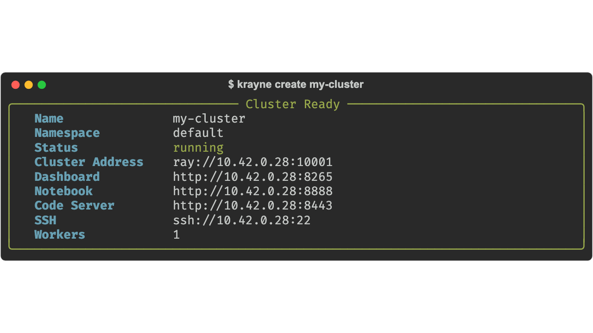
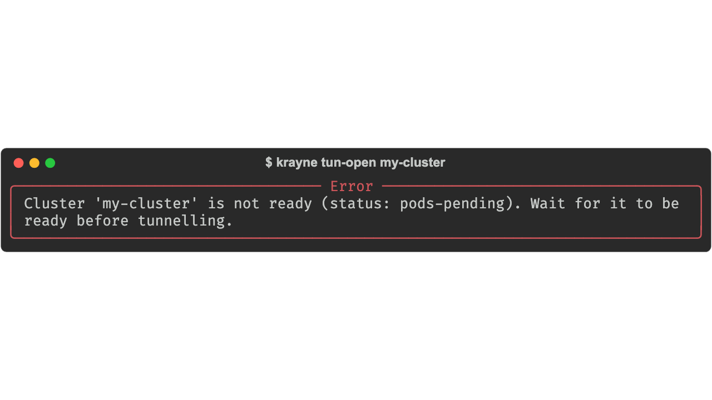
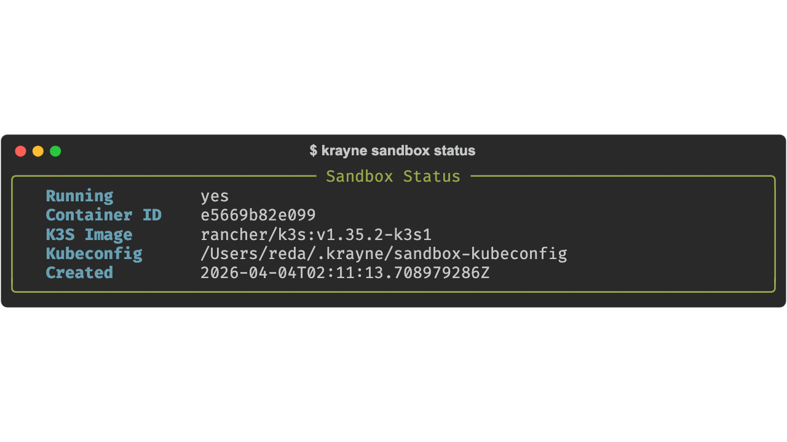

# CLI Reference

Krayne provides a command-line interface built with [Typer](https://typer.tiangolo.com/) and [Rich](https://rich.readthedocs.io/) for managing Ray clusters on Kubernetes.

## Global options

These options are available on every command:

| Option | Description |
|---|---|
| `--version`, `-V` | Show version and exit |
| `--debug` | Show full tracebacks on error |
| `--output`, `-o` | Output format: `table` (default) or `json` |
| `--kubeconfig` | Path to kubeconfig file |

---

## `krayne init`

Initialize Krayne with kubeconfig and Kubernetes context. Saves settings to `~/.krayne/config.yaml`.

```
krayne init [OPTIONS]
```

**Options:**

| Option | Default | Description |
|---|---|---|
| `-k`, `--kubeconfig` | — | Path to kubeconfig file (skips interactive prompt) |
| `-c`, `--context` | — | Kubernetes context name (skips interactive prompt) |

**Examples:**

```bash
# Interactive mode — select kubeconfig and context from menus
krayne init

# Non-interactive mode
krayne init --kubeconfig ~/.kube/config --context my-context
```

```title="Terminal output"
╭─ Krayne Initialized ─────────────────────────╮
│  Kubeconfig:   ~/.kube/config               │
│  Context:      my-context                   │
╰─────────────────────────────────────────────╯
```

!!! note
    In interactive mode, Krayne presents a menu to select the kubeconfig source (default location, sandbox, or custom path), then lists available contexts.

---

## `krayne create`

Create a new Ray cluster.

```
krayne create <name> [OPTIONS]
```

**Arguments:**

| Argument | Description |
|---|---|
| `name` | Cluster name (required) |

**Options:**

| Option | Default | Description |
|---|---|---|
| `-n`, `--namespace` | `default` | Kubernetes namespace |
| `--gpus-per-worker` | `0` | Number of GPUs per worker node |
| `--worker-gpu-type` | `t4` | GPU accelerator type (e.g. `t4`, `a100`, `v100`) |
| `--cpus-in-head` | `15` | CPU count for the head node |
| `--memory-in-head` | `48Gi` | Memory for the head node |
| `--workers` | `1` | Number of worker replicas |
| `--wait`, `-w` | `false` | Wait for cluster to be ready before returning |
| `--timeout` | `300` | Timeout in seconds when using `--wait` |
| `--file`, `-f` | — | Path to a YAML config file |

**Examples:**

```bash
# Minimal — all defaults
krayne create my-cluster

# GPU cluster with 2 workers
krayne create gpu-cluster --gpus-per-worker 1 --worker-gpu-type a100 --workers 2

# From YAML config, wait for ready
krayne create my-cluster --file cluster.yaml --wait --timeout 600

# JSON output
krayne create my-cluster --output json
```



!!! tip "Local access"
    Use `krayne tun-open <cluster-name>` to create localhost mirrors of all cluster services via `kubectl port-forward`. Use `krayne tun-close <cluster-name>` to stop.

!!! note
    When using `--file`, the `name` argument and any CLI flags override the corresponding values in the YAML file.

---

## `krayne get`

List all Ray clusters in a namespace.

```
krayne get [OPTIONS]
```

**Options:**

| Option | Default | Description |
|---|---|---|
| `-n`, `--namespace` | `default` | Kubernetes namespace |

**Examples:**

```bash
# List clusters in default namespace
krayne get

# List clusters in a specific namespace
krayne get -n ml-team

# JSON output for scripting
krayne get --output json
```


---

## `krayne describe`

Show detailed information about a cluster, including head node and worker group resource allocations.

```
krayne describe <name> [OPTIONS]
```

**Arguments:**

| Argument | Description |
|---|---|
| `name` | Cluster name (required) |

**Options:**

| Option | Default | Description |
|---|---|---|
| `-n`, `--namespace` | `default` | Kubernetes namespace |

**Examples:**

```bash
krayne describe my-cluster
krayne describe my-cluster -n ml-team --output json
```


---

## `krayne scale`

Scale a worker group of a cluster to a target replica count.

```
krayne scale <name> [OPTIONS]
```

**Arguments:**

| Argument | Description |
|---|---|
| `name` | Cluster name (required) |

**Options:**

| Option | Default | Description |
|---|---|---|
| `-n`, `--namespace` | `default` | Kubernetes namespace |
| `-g`, `--worker-group` | `worker` | Name of the worker group to scale |
| `-r`, `--replicas` | — | Target replica count (required) |

**Examples:**

```bash
# Scale default worker group to 4 replicas
krayne scale my-cluster --replicas 4

# Scale a named worker group
krayne scale my-cluster --worker-group gpu-workers --replicas 8 -n ml-team
```


---

## `krayne delete`

Delete a Ray cluster.

```
krayne delete <name> [OPTIONS]
```

**Arguments:**

| Argument | Description |
|---|---|
| `name` | Cluster name (required) |

**Options:**

| Option | Default | Description |
|---|---|---|
| `-n`, `--namespace` | `default` | Kubernetes namespace |
| `--force` | `false` | Skip confirmation prompt |

**Examples:**

```bash
# Interactive confirmation
krayne delete my-cluster

# Skip confirmation
krayne delete my-cluster --force

# Delete from specific namespace
krayne delete my-cluster -n ml-team --force
```


---

## `krayne tun-open`

Start tunnels for cluster services to localhost via `kubectl port-forward`. Processes run in the background — use `tun-close` to stop them.

Both commands are **idempotent**: starting an already-active tunnel is a no-op (shows the existing tunnel info), and closing a non-existent tunnel is a no-op.

```
krayne tun-open <name> [OPTIONS]
```

**Arguments:**

| Argument | Description |
|---|---|
| `name` | Cluster name (required) |

**Options:**

| Option | Default | Description |
|---|---|---|
| `-n`, `--namespace` | `default` | Kubernetes namespace |

Local ports are deterministically assigned from the cluster name and namespace, so the same cluster always gets the same local ports.

**Examples:**

```bash
# Start tunnels for all services on a cluster
krayne tun-open my-cluster

# Start tunnels in a specific namespace
krayne tun-open my-cluster -n ml-team

# Get tunnel info as JSON
krayne tun-open my-cluster --output json
```



!!! note
    The cluster must be in `ready` or `running` state. Tunnels forward to the head Service (`svc/<name>-head-svc`), which survives pod restarts.

---

## `krayne tun-close`

Stop tunnels for a cluster. Terminates all background `kubectl port-forward` processes.

```
krayne tun-close <name> [OPTIONS]
```

**Arguments:**

| Argument | Description |
|---|---|
| `name` | Cluster name (required) |

**Options:**

| Option | Default | Description |
|---|---|---|
| `-n`, `--namespace` | `default` | Kubernetes namespace |

**Examples:**

```bash
krayne tun-close my-cluster
krayne tun-close my-cluster -n ml-team
```

---

## `krayne sandbox setup`

Set up a local k3s cluster with KubeRay for development.

```
krayne sandbox setup
```

Requires Docker with at least 2 CPUs and 6 GB RAM. Creates a k3s container named `krayne-sandbox` and installs the KubeRay operator.

```title="Terminal output"
          Sandbox Setup
  Component             Status
  Docker                ✓ ready
  K3S Container         ✓ ready
  K3S Node              ✓ ready
  Kubeconfig            ✓ ready
  KubeRay Helm Chart    ✓ ready
  RayCluster CRD        ✓ ready
  Operator Ready        ✓ ready
╭─ Sandbox Ready ─────────────────────────────────╮
│  Status        running                          │
│  Kubeconfig    ~/.krayne/sandbox-kubeconfig       │
╰─────────────────────────────────────────────────╯
╭─ Next Steps ────────────────────────────────────╮
│  1.  krayne init — select the sandbox            │
│      kubeconfig and context                     │
│  2.  krayne create my-cluster — launch your      │
│      first Ray cluster                          │
╰─────────────────────────────────────────────────╯
```

After setup, run `krayne init` to select the sandbox kubeconfig and context.

---

## `krayne sandbox teardown`

Tear down the local sandbox cluster.

```
krayne sandbox teardown
```

Removes the Docker container, deletes the sandbox kubeconfig, and clears Krayne settings if they point to the sandbox.

---

## `krayne sandbox status`

Show current status of the sandbox.

```
krayne sandbox status
```



---

## Output formats

### Table (default)

Rich-formatted tables and panels for human-readable output:

```bash
krayne get
krayne describe my-cluster
```

### JSON

Machine-readable JSON output, useful for scripting:

```bash
krayne get --output json
krayne describe my-cluster -o json | jq '.info.status'
```

---

## Error handling

Errors are displayed as Rich panels by default. Use `--debug` to see full Python tracebacks:

```bash
krayne describe nonexistent-cluster --debug
```


All errors are instances of `KrayneError` subclasses. See [Error Types](errors.md) for the full exception hierarchy.
