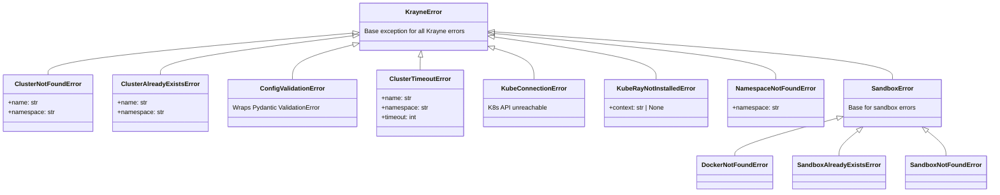

# Error Types

Krayne defines a flat exception hierarchy rooted at `KrayneError`. All exceptions are importable from `krayne.errors`.

```python
from krayne.errors import (
    KrayneError,
    ClusterNotFoundError,
    ClusterAlreadyExistsError,
    ConfigValidationError,
    ClusterTimeoutError,
    KubeConnectionError,
    KubeRayNotInstalledError,
    NamespaceNotFoundError,
    SandboxError,
    DockerNotFoundError,
    SandboxAlreadyExistsError,
    SandboxNotFoundError,
)
```

## Exception hierarchy



All exceptions inherit from `KrayneError`, so you can catch all Krayne errors with a single handler.

---

## Exceptions

### `KrayneError`

Base exception for all Krayne errors. Catch this to handle any Krayne-specific error.

```python
from krayne.errors import KrayneError

try:
    info = create_cluster(config)
except KrayneError as e:
    print(f"Krayne error: {e}")
```

---

### `ClusterNotFoundError`

Raised when an operation targets a cluster that does not exist.

**Attributes:**

| Attribute | Type | Description |
|---|---|---|
| `name` | `str` | Cluster name |
| `namespace` | `str` | Kubernetes namespace |

**Raised by:** `get_cluster`, `describe_cluster`, `scale_cluster`, `delete_cluster`, `wait_until_ready`

```python
from krayne.errors import ClusterNotFoundError

try:
    info = get_cluster("nonexistent")
except ClusterNotFoundError as e:
    print(f"Cluster '{e.name}' not found in '{e.namespace}'")
```

---

### `ClusterAlreadyExistsError`

Raised when creating a cluster with a name that's already in use in the target namespace.

**Attributes:**

| Attribute | Type | Description |
|---|---|---|
| `name` | `str` | Cluster name |
| `namespace` | `str` | Kubernetes namespace |

**Raised by:** `create_cluster`

---

### `ConfigValidationError`

Raised when cluster configuration is invalid — wraps Pydantic `ValidationError` with a clear message.

**Raised by:** `load_config_from_yaml`, `ClusterConfig` construction

```python
from krayne.errors import ConfigValidationError

try:
    config = load_config_from_yaml("bad-config.yaml")
except ConfigValidationError as e:
    print(f"Invalid config: {e}")
```

---

### `ClusterTimeoutError`

Raised when `wait_until_ready` exceeds the specified timeout.

**Attributes:**

| Attribute | Type | Description |
|---|---|---|
| `name` | `str` | Cluster name |
| `namespace` | `str` | Kubernetes namespace |
| `timeout` | `int` | Timeout that was exceeded (seconds) |

**Raised by:** `create_cluster` (with `wait=True`), `wait_until_ready`

---

### `KubeConnectionError`

Raised when the Kubernetes API is unreachable — no valid kubeconfig, network issues, or API server errors.

**Raised by:** Any SDK function that communicates with Kubernetes.

---

### `KubeRayNotInstalledError`

Raised when the target Kubernetes cluster does not have the KubeRay operator installed (the `rayclusters.ray.io` CRD is missing). This check runs whenever a kube client is constructed (CLI, TUI, SDK, and `krayne init`).

**Attributes:**

| Attribute | Type | Description |
|---|---|---|
| `context` | `str \| None` | Kube context against which the check ran (if known) |

**Raised by:** `krayne init` (dry-run check) and any SDK function that builds a kube client.

---

### `NamespaceNotFoundError`

Raised when the specified Kubernetes namespace does not exist.

**Attributes:**

| Attribute | Type | Description |
|---|---|---|
| `namespace` | `str` | The namespace that was not found |

**Raised by:** `create_cluster`

---

### `SandboxError`

Base exception for sandbox-related errors.

---

### `DockerNotFoundError`

Raised when Docker CLI is not available or the Docker daemon is not running.

**Raised by:** `setup_sandbox`

---

### `SandboxAlreadyExistsError`

Raised when a sandbox container already exists.

**Raised by:** `setup_sandbox`

---

### `SandboxNotFoundError`

Raised when attempting to tear down a sandbox that doesn't exist.

**Raised by:** `teardown_sandbox`

---

## Which functions raise which errors

| Function | Possible Errors |
|---|---|
| `create_cluster` | `ClusterAlreadyExistsError`, `NamespaceNotFoundError`, `ClusterTimeoutError`, `KubeConnectionError`, `KubeRayNotInstalledError`, `ConfigValidationError` |
| `get_cluster` | `ClusterNotFoundError`, `KubeConnectionError`, `KubeRayNotInstalledError` |
| `list_clusters` | `KubeConnectionError`, `KubeRayNotInstalledError` |
| `describe_cluster` | `ClusterNotFoundError`, `KubeConnectionError`, `KubeRayNotInstalledError` |
| `scale_cluster` | `ClusterNotFoundError`, `KrayneError` (worker group not found / no arg given), `KubeConnectionError`, `KubeRayNotInstalledError` |
| `delete_cluster` | `ClusterNotFoundError`, `KubeConnectionError`, `KubeRayNotInstalledError` |
| `wait_until_ready` | `ClusterTimeoutError`, `ClusterNotFoundError`, `KubeConnectionError`, `KubeRayNotInstalledError` |
| `get_cluster_services` | `ClusterNotFoundError`, `KubeConnectionError`, `KubeRayNotInstalledError` |
| `open_tunnel` | `ClusterNotFoundError`, `KubeConnectionError`, `KubeRayNotInstalledError` |
| `setup_sandbox` | `DockerNotFoundError`, `SandboxAlreadyExistsError`, `SandboxError` |
| `teardown_sandbox` | `SandboxNotFoundError` |
